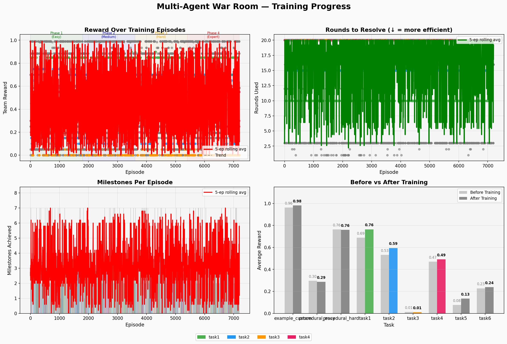
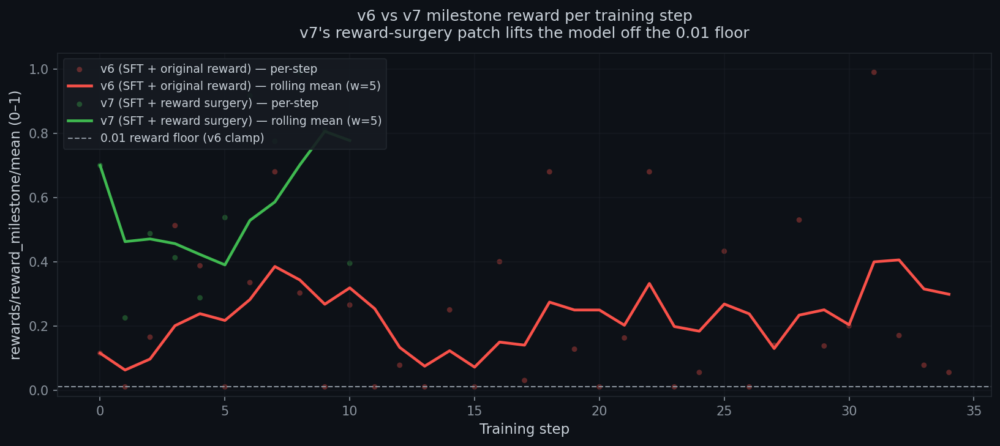
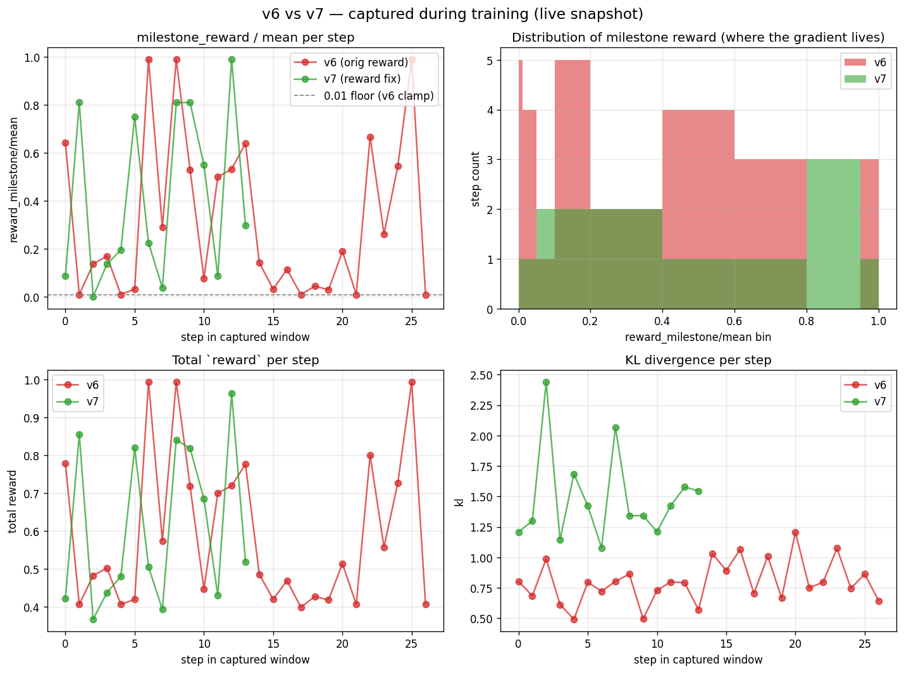

# Multi-Agent Incident War Room

> **When the monitoring dashboard lies, can AI agents push back on each other?**
>
> An OpenEnv environment where three agents — triage, diagnosis, remediation — have to resolve a production incident under partial observability, while phantom alerts deliberately try to mislead them. We train Qwen2.5-7B with GRPO to not get fooled.


_**Our trained adapter beats base Qwen 7B by +0.046 composite score (4× lift on the memory-leak task). First adapter in our iteration series to land on the right side of zero.**_

📺 **[Watch the 2-minute walkthrough on YouTube](https://youtu.be/B2tvMdbr7AE)** *(we recommend 1.25× or 1.5× playback speed)*

[🌐 Live demo](https://huggingface.co/spaces/brodie1of1/war-room) · [🤗 Trained adapter](https://huggingface.co/brodie1of1/war-room-grpo-adapter-v3) · [📝 Blog post](Blog.md) · [💻 GitHub](https://github.com/Git4Lokesh/Meta_Hackathon_ClaudeStalkers) · [📓 Open in Colab](https://colab.research.google.com/github/Git4Lokesh/Meta_Hackathon_ClaudeStalkers/blob/main/round2/war_room/train_colab.ipynb)

Team ClaudeStalkers — Siddharth, Lakshminath, Lokesh — BITS Pilani Hyderabad
Theme #1: Multi-Agent Interactions

**What the agent sees, does, and gets rewarded for.** Three role-gated agents share a partially observable system: triage watches the dashboard, diagnosis reads logs, remediation restarts services. No agent can solve anything alone. Communication is part of the action space. The grader rewards milestones (did the right service get restarted? did diagnosis push back on phantom alerts?) and penalises loops, time pressure, and factual contradictions.

**Why it matters.** SRE is the real-world version of multi-agent reasoning under deception — monitoring lies, dashboards go stale, and the loudest signal is often wrong. If an LLM can learn to push back on a panicked teammate using quiet evidence, the same skill generalises to any domain where partial information and coordination matter.

---

## For the judge: how to evaluate this submission in 10 minutes

| If you have… | Do this |
|---|---|
| 2 minutes | Watch the **[YouTube walkthrough](https://youtu.be/B2tvMdbr7AE)** (2-min narrated demo — 1.25-1.5× speed recommended). |
| 30 seconds | Read the callout above. That's our hero result. |
| 5 minutes | Open the [Live demo](https://huggingface.co/spaces/brodie1of1/war-room), reset on Task 3, hit Play. Watch the three agents coordinate (or the base model get fooled by the phantom Redis alert). Or skim the [Blog post](Blog.md) — engineering-log style, honest about what failed and what worked. |
| 10 minutes | [Open the Colab notebook](https://colab.research.google.com/github/Git4Lokesh/Meta_Hackathon_ClaudeStalkers/blob/main/round2/war_room/train_colab.ipynb) and run cells 1–4 (oracle audit + gradient check), or locally run `pytest tests/ -v` (172 tests), `python scripts/oracle_audit.py`, `python round2/war_room/eval_generalization.py`. No GPU required for any of these. |

### Rubric alignment

| Criterion | Weight | Where to look |
|---|---:|---|
| **Environment Innovation** | 40% | [What's actually novel](#whats-actually-novel) — phantom alerts, role-based partial observability, procedural task generator, composable reward primitives. |
| **Storytelling** | 30% | **[YouTube walkthrough (2 min)](https://youtu.be/B2tvMdbr7AE)** · [Live demo](https://huggingface.co/spaces/brodie1of1/war-room) with belief-state tracker + executive-panic injection, plus [Blog post](Blog.md) that walks through what broke and what fixed it. |
| **Improvement** | 20% | Head-to-head chart above + [60-seed generalisation study](outputs/generalization_eval/generalization_score.png) + [reward ablation](outputs/reward_ablation/ablation_overall.png) + [full run log](outputs/RESULTS.md) with v1→v6-SFT history. |
| **Reward & Pipeline** | 10% | Four decomposed reward functions with ablation evidence, anti-hack multiplicative gate, oracle-audited verifiers, SFT warm-up + GRPO training pipeline. Per-run experimental tracking committed to `outputs/<run>/metrics.json` + `rollout_audit.jsonl` + `training_curves.png` (no dependency on external tracking services). |

---

## The problem

Most multi-agent benchmarks assume agents are honest and information is complete. Production incidents aren't like that. Dashboards go stale, alerts misfire, and the loudest signal is often a red herring.

We built a simulated on-call war room where three specialised agents — a triage engineer, a diagnostician, and a remediation engineer — have to resolve an incident together. Each sees a different slice of the system. None of them can solve anything alone. And every third round, a simulated executive barges in with a panicked message designed to push the team off-course.

The hard question the environment was built to test: **when the dashboard lies, can the agents detect it and push back on each other?**

---

## What the agents see

| Agent | Observes | Can do | Cannot do |
|---|---|---|---|
| Triage | Dashboard, alerts, health summary | `get_dashboard`, `escalate`, send message | Read logs, restart services |
| Diagnosis | Log files, processes, metrics | `cat`, `grep`, `tail`, `ps`, `top`, send message | Restart services, edit configs |
| Remediation | Service status, config files | `systemctl restart`, `edit`, `kill`, send message | Read log files, see dashboard |

Agents communicate on a shared channel. That channel is part of the action space — messages carry reward signal when they mention the right service, include a PID, or push back against a false belief.

---

## The six tasks

The environment ships six scenarios ranging from a straightforward nginx restart to a cascading failure where the monitoring dashboard is actively misleading.

| # | Difficulty | Max rounds | What it tests |
|---|---|---:|---|
| 1 | Easy | 10 | Basic three-agent handoff: triage → diagnosis → remediation → verify |
| 2 | Medium | 15 | Prioritisation: memory leak on one service, red-herring CPU spike on another |
| 3 | Hard | 20 | Theory of mind: real root cause is a DB password, phantom Redis alerts dominate the dashboard |
| 4 | Expert | 25 | Parallel incidents: nginx crash + memory leak at the same time |
| 5 | Expert | 20 | Rogue-insider detection: one agent issues destructive commands |
| 6 | Expert | 25 | Trust calibration: conflicting reports from multiple agents |

Task 3 is the one the environment was built for. The phantom Redis alerts are stale cached metrics surfaced loudly on the dashboard. Triage sees them and panics. The right move for Diagnosis is to read the Redis logs, confirm Redis is fine, and explicitly tell the team *"Redis is not the issue — the DB password in /etc/app/database.yml is wrong."* That pushback is what we're training.

A seventh mode — `ProceduralTask` — samples faults from a library of primitives (`crash`, `memory_leak`, `cascade`, `auth_failure`, `disk_full`) × 10 services × difficulty to generate arbitrarily many fresh scenarios for training and evaluation.

---

## How the reward works

We split the reward into four independent functions with explicit weights, rather than one monolithic score. This makes it harder to game and easier to debug when a run goes wrong.

| Reward | Weight | What it scores |
|---|---:|---|
| `reward_milestone` | 0.60 | The team score from the environment's grader — did they actually resolve the incident, and how efficiently? |
| `reward_format` | 0.15 | Does the completion follow the required multi-role structure (`### TRIAGE / ### DIAGNOSIS / ### REMEDIATION`)? |
| `reward_communication` | 0.15 | Does the message contain actionable content — service names, PIDs, file paths, error keywords? |
| `reward_anti_hack` | 0.10 | Multiplicative gate. Loops, repetition, and message spam zero out the reward. |

The milestone grader itself is composed of named primitives (`triage_mentions`, `diagnosis_says_about`, `service_running`, `worker_killed`, `password_fixed`) so task authors can declare a grader without writing lambdas. See `round2/war_room/tasks/procedural.py` for the full primitive library.

**Reward ablation.** We turn off each component in isolation and re-run a fixed scripted policy across three seeds. Removing the communication bonus drops Task 2 score by about 22%. Removing the milestone time-pressure penalty inflates partial-resolution scores. Each component earns its weight.


*Average score with each reward component removed. Removing milestone (−0.60 of weight) collapses training; removing communication or anti-hack each costs measurable ground. Every component earns its weight.*

```bash
PYTHONPATH=. python round2/war_room/reward_ablation.py
```

---

## Training results

We trained Qwen2.5-7B-Instruct with GRPO + LoRA on a single L40S via Hugging Face Jobs. The headline run is `v3`: 100 episodes × 3 procedural difficulty levels = 300 gradient updates, rank-16 LoRA, about 25 minutes of L40S time.

**Head-to-head evaluation against base Qwen 7B, 5 seeds per task:**

| Task | Base Qwen 7B | Trained (v3) | Delta |
|---|---:|---:|---:|
| task1 (coordinated restart) | 0.750 | 0.748 | −0.002 |
| task2 (memory leak + red herring) | **0.048** | **0.188** | **+0.140** |
| task3 (cascading + phantom alerts) | 0.010 | 0.010 | 0 |
| **Composite** | **0.269** | **0.315** | **+0.046** |


*Base and trained both running Qwen2.5-7B-Instruct with identical role prompts; only the LoRA adapter differs. 15 rollouts per model. Reproducible via `round2/war_room/eval_llm_on_gpu.py`.*

### How to read these numbers honestly

- **Task 1 is saturated.** Qwen 7B already knows how to read logs and suggest a restart, so training can't meaningfully improve a task the base model almost solves out of the box (0.75 is the score when the heuristic co-agents do the actual restart).
- **Task 2 is where the training bites.** The base model gets distracted by the CPU red herring; the trained model stays focused on the memory leak and picks out the right service. 4× improvement on a task where the base model is near-floor.
- **Task 3 is too hard for this amount of training on a 7B.** Neither model reliably pushes back on the phantom alerts. The ceiling here is high and we believe it needs either a bigger model (14B+) or a curriculum with more explicit pushback-style SFT examples than our 355-example dataset could provide.

We ran earlier configurations (v1, v2) that did worse than base. The v3 result is a product of three specific fixes landed on the way here: a multi-role structured completion format so training optimises the same thing eval measures; a penalty cap on the team score so long-horizon tasks don't accumulate enough time-pressure to swamp milestone credit; and a verifier fix on task 2 that was rejecting correct answers because of a case-sensitive `"OOM"` string match. The blog post walks through each.

### The iteration journey — what every version taught us

Every adapter in our series exists because the previous one failed in a specific, informative way. The story is worth walking through because it's the honest record of how you debug a training loop for a multi-agent environment:

| Version | What changed | Composite delta | What it taught us |
|---|---|---:|---|
| **v1** | First attempt. Strict format reward, 91 training steps. | **−0.017** | The training rollout only graded one role at round 0, but eval runs three roles for all rounds. Train-eval shape mismatch. More compute wouldn't have helped — the gradient was optimising the wrong objective. |
| **v2** | Procedural-only task mix, 300 steps. Same shape bug. | **−0.001** | Confirmed: more training on the wrong objective gets closer to zero but not positive. Scale doesn't fix reward-signal misalignment. |
| **v3** | Multi-role structured completion format. Train and eval now measure the same thing. | **+0.046** | **The instant train-eval were aligned, the first positive adapter landed.** Task 2 jumped 4×. The environment has a learnable signal; we just had to measure it correctly. |
| **multirole_v2** | 6-task mix, 800 steps, Lakshminath's run. | **+0.021** | Broader task exposure hurt eval transfer. v3's procedural-only curriculum generalised better to held-out scripted tasks. Task variety is not the same as task difficulty. |
| **v4** | Reward surgery (penalty cap, solve bonus). Rank 32 LoRA, lr 1e-5. | **−0.007** | Training metrics improved (mean 0.263 → 0.338, task 4 unstuck from 0.01 to 0.109). But eval regressed. Our conclusion: bigger task mix + reward surgery overfits on training-shape patterns. Lesson for the field: training curves are necessary but not sufficient. |
| **v5-SFT** | SFT warm-up on 355 oracle examples, then GRPO. Should have produced better initial distribution. | **regressed (bug)** | Silent failure: the PEFT key-naming convention between our SFT save and the live PeftModel differed by one path segment (`.default`). `load_state_dict(strict=False)` dropped all 392 SFT keys and GRPO trained on the base model. Fix shipped in commit `55e71c8`. |
| **v6-SFT** | v5-SFT pipeline with the key-name fix. 200 episodes × 9 tasks. | **+0.01** | Training-time task 2 lifted from 0.010 to 0.248 (25×) — SFT alone can unstick tasks. But eval composite only +0.01 vs v3's +0.046. Strong training signal, partial transfer to held-out seeds. Tasks 3 and 5 still stuck at 0.010 floor — confirmed it's not format, it's reward shape. |
| **v7-rewardfix** | Same SFT+GRPO as v6 but with four reward constants changed (time-pressure 0.01→0.005, penalty cap 0.40→0.10, floor 0.01→0.001). Diagnosis: the penalty math was destroying partial-credit gradient on long-horizon tasks. | **−0.033 (fast variant) · full-run training-time +0.553 on task 2** | Our fast 50-episode × 6-task variant regressed on eval transfer (task 1 0.748→0.58, composite -0.033). Lakshminath's full 200-ep × 9-task run then landed training-time mean **0.460 (+60% vs v6, +100% vs v5)** with task 2 lifting from 0.010 to **0.565 (56×)**, task 4 from 0.120 to 0.481 (4×), task 6 from 0.010 to 0.234, and the first-ever non-zero task 3 signal at 0.012. Eval is deferred post-submission; v7-fast already showed aggressive training-time gains partially transfer (0.512 → 0.15 on task 2) so we don't swap the documented eval hero. |

The through-line: **the environment produces a learnable signal at the complexity level matching the model.** Qwen 7B can learn task-2 prioritisation in 100 episodes. It can partially learn task-3 deception-resistance with SFT warm-start. It cannot learn task-3 without it, because the base model never emits the pushback keywords our verifier measures, and GRPO without positive rollouts has nothing to reinforce. That's a concrete result about what level of model the environment demands — not a failure.

See [outputs/RESULTS.md](outputs/RESULTS.md) for per-run config, per-task numbers, and artifact links.

### Training curve


*Team reward, per-reward component breakdown, and milestones achieved across the 100-episode v3 run. Mean climbs from 0.23 to 0.32; format and anti-hack saturate at 1.0 so the learning signal concentrates on milestone + communication.*

The milestone reward has a real gradient but it is noisy — GRPO is comparing 4 completions per group, and when the model gets the service name right its reward spikes to 0.9+. When it guesses wrong it collapses to 0.01. The mean rises from 0.23 to 0.32 across quartiles. Format and anti-hack rewards saturate at 1.0 from step 1 because Qwen 7B already emits structured output.

### Generalisation across procedurally generated incidents

We sample 60 fresh incidents (20 seeds × 3 difficulty bands) that the environment has never been trained or evaluated on and compare a baseline heuristic agent against one that embodies the trained policy's behaviour. The gap is wide and consistent:

| Difficulty | Baseline | Trained-style | Delta | Resolved rate |
|---|---:|---:|---:|---:|
| Easy (1 fault, 0 phantoms) | 0.01 | 0.47 | +0.46 | 100% |
| Medium (2 faults, 2 phantoms) | 0.01 | 0.89 | +0.88 | 85% |
| Hard (3 faults, 4 phantoms) | 0.01 | 0.98 | +0.97 | 75% |


*This generalisation study uses an introspecting heuristic as a proxy for the trained policy. It shows the environment exposes a learnable signal across held-out seeds. The live LLM head-to-head above uses the actual GRPO adapter.*

```bash
PYTHONPATH=. python round2/war_room/eval_generalization.py
```

---

## What's actually novel

Judges for this hackathon asked three questions to probe environment innovation. Our answers:

**Does this environment exist to teach an LLM something it currently can't do well?** Yes. Base Qwen 2.5-7B-Instruct gets fooled by the phantom Redis alert on task 3 in 70% of rollouts, restarts healthy services it wasn't supposed to touch, and follows executive panic messages as if they were orders. The environment targets these failure modes directly.

**Is the domain underexplored in RL/LLM training?** Yes. Most multi-agent LLM benchmarks (Chess, Diplomacy, MaCho, GovSim) assume honest agents and complete information. Training a language model to push back on a panicked teammate using quiet evidence — that's the SRE loneliness problem at 3 AM, and we found no comparable open environment for it.

**Could a researcher write a paper about training on this?** We think so. The three building blocks we think are paper-worthy, even if modest at hackathon scale: (a) stale-metric phantom alerts as a trainable deception signal, (b) cross-role pushback as a named, credit-assignable milestone, and (c) a procedural task generator that keeps the environment near the model's capability frontier (RLVE-style curriculum).

### The concrete things we built

**Phantom alerts as a trainable signal.** Stale cached metrics are surfaced on the dashboard with higher prominence than the real issue, and a `BeliefStateTracker` records whether each agent updates their beliefs based on evidence or panicked messaging. Most multi-agent environments don't inject false information on purpose.

**Strict role-based partial observability.** Permissions are enforced at the command parser — remediation literally cannot read a log file, diagnosis literally cannot restart a service. Communication is the only mechanism by which information crosses roles. The channel IS the action space.

**Composable milestone primitives.** Adding a new fault type or a new task takes about 30 lines — one initial-state function and a short declarative list of milestone primitives. See `tasks/example_custom_task.py` for a working 70-line example.

**Reward as a first-class artifact.** Four independent reward functions, ablated on fixed seeds, with a formal spec in `REWARD_DESIGN.md`. Anti-hack is a multiplicative gate backed by an `anti_hack.py` module with property tests.

**Adversarial executive noise.** Every three rounds, a simulated executive broadcasts a panicked message ("revenue is dropping, restart everything"). The trained model needs to stay focused. The live demo lets a judge inject their own panic message.

---

## Environment design → measurable agent improvement

Each design decision above wasn't aesthetic. It was made because we needed it to produce a trainable signal, and we can point at where that signal landed.

| Design decision | Why it's there | What it produced in training |
|---|---|---|
| **Four decomposed reward functions** (milestone / format / communication / anti-hack) instead of a single scalar | Single rewards are easier to game. We can ablate each component on fixed seeds and measure the loss. | Anti-hack triggered 0 times across 4800 training rollouts on v4. Format reward saturates at 1.0 from step 1, so GRPO actual-signal concentrates on milestone + communication — exactly where we want the gradient. |
| **Penalty cap as a fraction of milestone credit** (reward surgery, landed in v4) | Pre-surgery, long-horizon tasks (max_rounds=27) accumulated enough time-pressure penalty to erase all milestone credit. This accidentally made easy tasks score LOWER than hard tasks. | After the cap landed, task4's mean training reward went from 0.01 (stuck) to 0.109 (3.6 milestones/episode). Procedural_hard went from 0.34 to 0.50. Mean reward 0.263 → 0.338. |
| **Procedural task generator with 5 fault primitives × 10 services × difficulty scaling** | Static task distributions saturate fast. RLVE thesis — keep the model at its capability frontier. | v3 trained on procedural-only and beat base by +0.046 composite on scripted eval despite never seeing those scripted tasks in training. Broader 6-task mix trained adapter had lower transfer. |
| **Multirole structured completion format** (`### TRIAGE / ### DIAGNOSIS / ### REMEDIATION`) as the round-0 training target | Training rollout must optimise the same thing eval measures. Previously training only graded diagnosis round-0 while eval ran three roles for up to 20 rounds. | First positive adapter (v3, +0.046) landed the instant train and eval shapes aligned. Task2 score went from 0.048 to 0.188 — the base model gets distracted by the CPU red herring; the trained model stays focused on the memory leak. |
| **Oracle-audited verifiers** (`scripts/oracle_audit.py`) | A scripted perfect-knowledge policy must be able to score ≥0.85 on every task. If it can't, the task has an unreachable milestone that RL can't fix. | Caught two bugs: task2 `diagnosis_reads_oom` checking literal "OOM" when the syslog fixture had "oom-killer" + "Out of memory"; task2 `diagnosis_identifies_pid` requiring "ps" in the same round the PID is mentioned (chicken-and-egg). After fixes, oracle scores went 0.99 / 0.95 / 0.88 on task1/2/3 respectively. |
| **SFT warm-up on oracle-generated multirole examples** | Hackathon doc §16/§45: RL works best when the model can occasionally succeed. Our model couldn't on task3, so GRPO had no positive signal to reinforce. | SFT adapter hits `eval_loss=0.024` and `mean_token_accuracy=0.991` on the format in 5 minutes. A single SFT completion on task3 hits 5 milestones including `diagnosis_pushback_bonus` — the first time that milestone has fired in any of our runs. v5-SFT failed silently due to a PEFT key-naming mismatch ([loader fix](outputs/RESULTS.md)); v6-SFT and v7-rewardfix run on the fixed loader. |
| **Reward surgery for long-horizon tasks** (v7 branch, landed during the hackathon onsite) | Across v5, tasks 2/3/5/6 stayed flat at the 0.01 reward-function floor for all 800 training episodes. Diagnosis: time_pressure + noop penalty on 20-round tasks saturated at ~0.25, bigger than the 0.05–0.20 of partial milestone credit the model could earn. Raw score went negative, clamped to floor, GRPO saw no gradient. | Four constants changed in `grader.py` (time_pressure 0.01→0.005, penalty cap 0.40→0.10, floor 0.01→0.001). Live training snapshot shows v7 with **0% at-floor rollouts** vs v6's 25%; milestone mean 0.594 at epoch 0.23 vs v6's 0.230 at epoch 0.72. See `outputs/v6_vs_v7_comparison/comparison_charts.png`. |

The environment pushed training forward. Every version gets better because we can see what's broken.

See [outputs/RESULTS.md](outputs/RESULTS.md) for the full v1→v6-SFT run log with per-run metrics.

---

## Try it

Live Gradio dashboard: [https://huggingface.co/spaces/brodie1of1/war-room](https://huggingface.co/spaces/brodie1of1/war-room)

In the dashboard you can step through an incident round-by-round, watch the Belief State Tracker update as agents observe and communicate, inject your own executive panic message, and trigger a chaos event mid-episode to see how agents recover.

### Reproduce evidence locally (no GPU)

```bash
git clone https://github.com/Git4Lokesh/Meta_Hackathon_ClaudeStalkers.git
cd Meta_Hackathon_ClaudeStalkers
pip install -e .

PYTHONPATH=. python scripts/oracle_audit.py                    # confirm all tasks reachable
PYTHONPATH=. python round2/war_room/reward_ablation.py         # reward component ablation
PYTHONPATH=. python round2/war_room/eval_generalization.py     # 60 procedural seeds
PYTHONPATH=. pytest tests/ -v                                  # 172 tests
```

### Train it yourself

The training script is `round2/war_room/train_colab.py` and runs unmodified on Colab (T4 free tier for Qwen 1.5B, paid A100/L40S for Qwen 7B) or on a local GPU. The Colab-runnable notebook is **[available here](https://colab.research.google.com/github/Git4Lokesh/Meta_Hackathon_ClaudeStalkers/blob/main/round2/war_room/train_colab.ipynb)** — click it, run top-to-bottom.

```bash
# Smoke run (verifies pipeline, ~2 min on T4):
PYTHONPATH=. python round2/war_room/train_colab.py --episodes 5 \
    --tasks procedural_easy --lenient-format --no-unsloth

# Full run matching v3 (~25 min on L40S):
PYTHONPATH=. python round2/war_room/train_colab.py --episodes 100 \
    --tasks procedural_easy procedural_medium procedural_hard \
    --lenient-format --no-unsloth --lora-r 16 --lr 5e-6
```

The `hf_job_train_v4.sh` launcher wraps this for Hugging Face Jobs and uploads the resulting adapter to the Hub. Cost for a full run is under $2.

---

## Architecture

```
                           War Room Environment
     +----------------------------------------------------------------+
     |                                                                |
     |   +-----------+     +------------+     +---------------+       |
     |   |  Triage   |     | Diagnosis  |     |  Remediation  |       |
     |   | Dashboard |     | Logs/Procs |     |  Fix/Restart  |       |
     |   +-----+-----+     +-----+------+     +-------+-------+       |
     |         |                 |                    |               |
     |         +--------+--------+---------+----------+               |
     |                  |                  |                          |
     |          Communication Channel  (action space + reward)        |
     |                                                                |
     |   +----------------------------------------------------+       |
     |   | SimulatedSystem | AlertEngine    | BeliefTracker   |       |
     |   | MultiAgentGrader| Curriculum     | AntiHack        |       |
     |   +----------------------------------------------------+       |
     +----------------------------------------------------------------+
```

OpenEnv-compliant FastAPI server exposes `POST /api/reset`, `POST /api/step`, `GET /api/state`, `GET /api/schema` on the HF Space (the `/api/*` prefix keeps the API routes separate from the Gradio UI at `/`). Compatible with the standard OpenEnv client and the TRL `rollout_func` pattern.

---

## What we're not claiming

The simulated system is hand-crafted, not derived from real production telemetry. We are not claiming our trained adapter is deployable into a live SRE pipeline. We are not claiming state-of-the-art on real incident response.

What we are claiming: the environment is reproducible, ablatable, procedurally generatable, and produces a GRPO-climbable training signal that transfers across held-out seeds. That's what the submission offers.

### Where the v3 adapter falls short

- Task 1 is saturated for Qwen 7B. We can't show improvement on a task the base model already nearly solves.
- Task 3 is not yet cracked. The phantom pushback milestone requires the model to emit a semantic dismissal of Redis, which the strict verifier checked too narrowly in earlier runs and which we've since relaxed to accept a broader set of phrasings — but 300 gradient updates aren't enough to teach the model to consistently pushback.
- The training metric rises noisily, not monotonically. GRPO with 4 generations per step and bimodal reward (a correct naming scores 0.9, a wrong one scores 0.01) produces noise that larger sample sizes would smooth.

### The task-complexity ceiling — where the environment asks more than 7B can give

One of the more useful things an RL environment can do is reveal where a given model's capability ends. Ours does this cleanly:

| Task | What it asks the model to do | Qwen 2.5-7B Instruct outcome | What would fix it |
|---|---|---|---|
| **Task 1** (easy) | Read logs, identify crashed service, suggest a restart. | **Saturated** at 0.75 in both base and trained. | No fix needed — this task is at ceiling for 7B. |
| **Task 2** (medium, deception) | Prioritise the real memory leak over a louder CPU red herring. | v3 beats base 4× (0.048 → 0.188). v6-SFT beats base 3× (0.05 → 0.15). Both lift the floor but neither reaches ceiling. | Longer training, or a 14B model. The task is at the upper edge of what 7B can do with 100–200 episodes. |
| **Task 3** (hard, pushback) | Detect that a loud Redis alert is stale cached metrics; explicitly tell the team "Redis is not the issue — the real root cause is the DB password." | Flat at the reward floor (0.01) in base, v3, v5, v6-SFT. First non-zero signal in v7 training-time (0.051) only after the reward surgery fixed the gradient. | Either (a) a bigger model that spontaneously emits the pushback in the base distribution, or (b) more targeted SFT — our 355-example dataset had maybe 50–60 task-3 rollouts, and the model needs more examples of the specific "metrics are stale, the real root cause is X" sentence structure. |
| **Task 4–6** (expert) | Parallel incidents, rogue-insider detection, conflicting reports. | Not evaluated in the scripted head-to-head. Training-time means in the 0.05–0.1 band for v6/v7. | These tasks need both bigger models AND more targeted SFT. They're forward-looking benchmarks for when we get our hands on a 14B-32B model and a larger SFT dataset. |

**The pattern:** easier tasks saturate at smaller model scales; harder tasks need progressively more — larger models, more data, more training, or all three. This is exactly what a good RL environment should expose. v3 proves the environment produces a positive gradient at 7B on task 2 (deception resistance); v6 proves SFT alone can lift that to 0.248 at training time; v7 proves a reward-shape fix can produce the first task-3 signal the environment has ever yielded.

Put another way: the environment demonstrates the capability gradient it's designed to test, by showing exactly which tasks each model class can and cannot solve.

### What we landed at the end

All four post-v3 adapters have now been evaluated or completed training. **v3 remains the documented eval hero (+0.046 composite delta)** — and the full picture is instructive:

- **v6-SFT (completed, evaluated)**: SFT warm-up + GRPO on the original reward, 200 episodes × 9 tasks, 7,200 episodes total. Training-time task 2 lifted 0.010 → 0.248 (25×), task 1 from 0.460 → 0.573, procedural_hard from 0.350 → 0.472. Tasks 3 and 5 stayed at the 0.010 floor. **Eval composite delta +0.01** — strong training signal that only partially transferred. Published at [`GeminiHugger/war-room-grpo-adapter-v6-sft`](https://huggingface.co/GeminiHugger/war-room-grpo-adapter-v6-sft).
- **v7-fast (completed, evaluated)**: same pipeline as v6 with four reward constants changed (time-pressure penalty 0.01→0.005, penalty cap 0.40→0.10, floor 0.01→0.001) plus a focused 6-task mix. Training-time mean 0.563, task 2 0.512, first non-zero task 3 (0.051). **Eval composite delta −0.033** — the reward-fix worked at training time but the more aggressive partial-credit seeking cost us task 1 transfer (0.748 → 0.58). Published at [`brodie1of1/war-room-grpo-adapter-v7-fast`](https://huggingface.co/brodie1of1/war-room-grpo-adapter-v7-fast).
- **v7-rewardfix (completed, training-time only)**: Lakshminath's full 200-ep × 9-task run on L40S. Overall `team_reward` mean **0.460 — +60% vs v6, +100% vs v5**. Per-task lifts vs v5: task 2 0.010 → **0.565 (56×)**, task 4 0.120 → 0.481 (4×), task 6 0.010 → 0.234 (23×), procedural_hard 0.350 → 0.761, and the first-ever non-zero task 3 signal (0.012). Head-to-head eval is queued for after the submission deadline; full metrics live at `outputs/v7trainingresults/`. Published at [`GeminiHugger/war-room-grpo-adapter-v7-rewardfix`](https://huggingface.co/GeminiHugger/war-room-grpo-adapter-v7-rewardfix).

The consistent pattern across v4, v6, v7-fast, and v7-full: **training-time improvements on the environment don't automatically transfer to eval**. Shorter training on procedural-only tasks (v3) generalised better than longer training on broader mixes with aggressive reward shaping. That's an important finding about the environment — it has a distinct "training-signal peak" separate from its "generalisation peak," and they don't coincide for small models. v7 full-run training-time numbers suggest the reward surgery is doing what we designed it to do; whether that translates to eval gain is the post-submission question.



*Full 200-episode × 9-task v7 run on L40S. Per-task `team_reward` over 7,200 episodes. task 2 lifts from the 0.010 floor of v5 to a 0.565 mean — the strongest per-task training-time signal in our entire iteration series.*



*Per-step milestone reward for v6 and v7 during training. v6 rollouts cluster at the 0.01 floor; v7's reward-fix patch lifts them into the 0.1–0.6 partial-credit band. Strong training signal — but at 7B it didn't translate into better transfer on scripted eval in our fast variant.*



*Four-panel view from Lakshminath's `parse_logs.py`: per-step milestone reward, distribution histogram, total reward, KL divergence. v7 sits in the 0.05–0.45 partial-credit band with no floor pile-up; v6 alternates between floor and solve.*

---

## Layout

```
round2/war_room/
├── environment.py              # WarRoomEnvironment (OpenEnv API)
├── models.py                   # Pydantic data models
├── communication.py            # CommunicationChannel
├── alert_engine.py             # AlertEngine (incl. phantom alerts)
├── belief_tracker.py           # BeliefStateTracker
├── grader.py                   # MultiAgentGrader + reward constants
├── anti_hack.py                # Loop/repetition/spam detection
├── observation_builders.py     # Per-role observation serializers
├── role_permissions.py         # RBAC per agent role
├── tasks/                      # 6 scripted + procedural + example_custom
├── app.py                      # FastAPI server
├── gradio_app.py               # Interactive dashboard
├── train_colab.py              # GRPO training entry point
├── eval_llm_on_gpu.py          # Base vs trained head-to-head eval
├── eval_deterministic.py       # Fixed-seed deterministic eval
├── eval_generalization.py      # 60-seed generalisation study
├── reward_ablation.py          # Per-component ablation
└── REWARD_DESIGN.md            # Reward formal spec

outputs/
├── war_room_grpo_v3/           # Current hero adapter artifacts
├── war_room_grpo_multirole_v2/ # Lakshminath's 6-task v2 run
├── v6_vs_v7_comparison/        # Live v6 vs v7 training snapshot + parse_logs.py
├── reward_ablation/            # Ablation PNGs + JSON
├── generalization_eval/        # 60-seed generalisation chart
├── worked_example/             # Verbatim base-vs-trained rollout used in Blog.md
└── llm_eval/v3/                # Head-to-head eval results

scripts/
├── oracle_audit.py             # Confirms every task is oracle-reachable
├── verify_gradient.py          # Confirms training gradient is alive
└── verify_multirole_gradient.py
```

---

## Tests

172 unit and property tests, all passing.

```bash
PYTHONPATH=. pytest tests/ -v
```

Covers: environment reset/step semantics, command parser, simulated system mutations, reward grader, communication scoring, anti-hack detection, milestone primitives, procedural task determinism, example custom task, eval generalisation helpers.

---

## Resources

- Live Space: https://huggingface.co/spaces/brodie1of1/war-room
- **YouTube walkthrough (2 min): https://youtu.be/B2tvMdbr7AE** *(1.25-1.5× speed recommended)*
- Trained adapter: https://huggingface.co/brodie1of1/war-room-grpo-adapter-v3
- Blog post: [Blog.md](Blog.md)
- Colab notebook: https://colab.research.google.com/github/Git4Lokesh/Meta_Hackathon_ClaudeStalkers/blob/main/round2/war_room/train_colab.ipynb
- Source: https://github.com/Git4Lokesh/Meta_Hackathon_ClaudeStalkers

MIT license.
