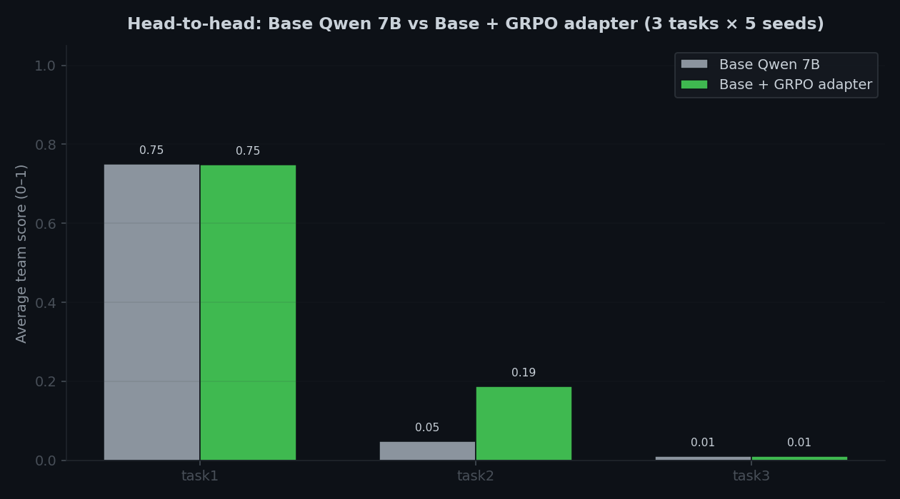
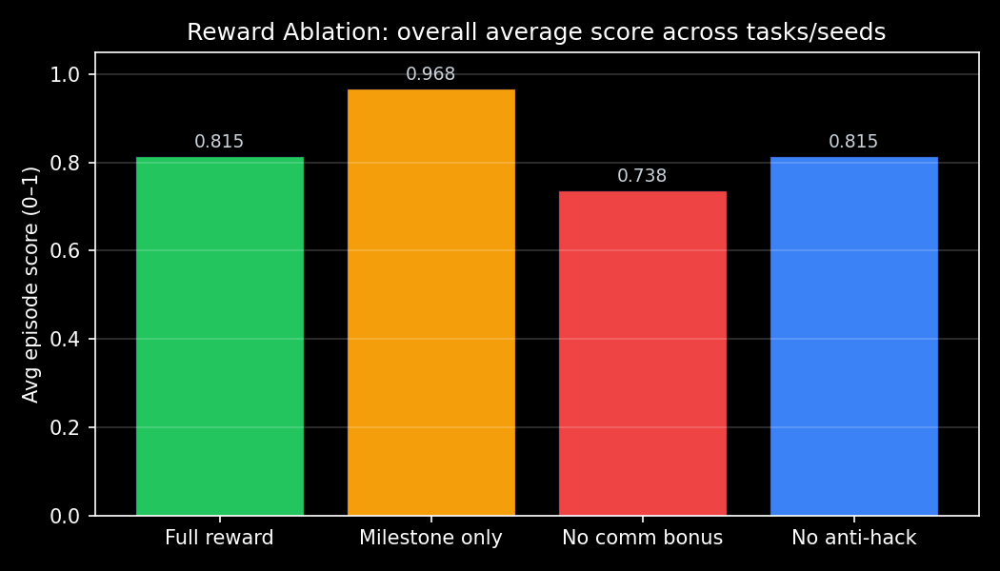
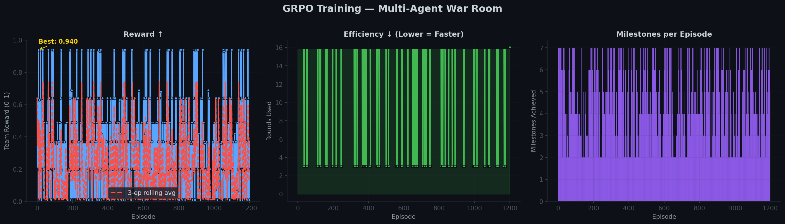
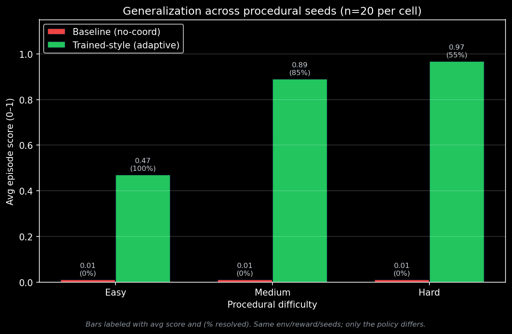

# Multi-Agent Incident War Room

> **When the monitoring dashboard lies, can AI agents push back on each other?**
>
> An OpenEnv environment where three agents — triage, diagnosis, remediation — have to resolve a production incident under partial observability, while phantom alerts deliberately try to mislead them. We train Qwen2.5-7B with GRPO to not get fooled.



_**Our trained adapter beats base Qwen 7B by +0.046 composite score (4× lift on the memory-leak task). First adapter in our iteration series to land on the right side of zero.**_

[🌐 Live demo](https://huggingface.co/spaces/brodie1of1/war-room) · [🤗 Trained adapter](https://huggingface.co/brodie1of1/war-room-grpo-adapter-v3) · [📝 Blog post](Blog.md) · [💻 GitHub](https://github.com/Git4Lokesh/Meta_Hackathon_ClaudeStalkers) · [📓 Colab notebook](round2/war_room/train_colab.ipynb)

Team ClaudeStalkers — Siddharth, Lakshminath, Lokesh — BITS Pilani Hyderabad
Theme #1: Multi-Agent Interactions

---

## For the judge: how to evaluate this submission in 10 minutes

| If you have… | Do this |
|---|---|
| 30 seconds | Read the callout above. That's our hero result. |
| 2 minutes | Open the [Live demo](https://huggingface.co/spaces/brodie1of1/war-room), reset on Task 3, hit Play. Watch the three agents coordinate (or the base model get fooled by the phantom Redis alert). |
| 5 minutes | Skim the [Blog post](Blog.md) — engineering-log style, honest about what failed and what worked. |
| 10 minutes | Run `pytest tests/ -v` (172 tests), `python scripts/oracle_audit.py`, `python round2/war_room/eval_generalization.py`. No GPU required. |

### Rubric alignment

| Criterion | Weight | Where to look |
|---|---:|---|
| **Environment Innovation** | 40% | [What's actually novel](#whats-actually-novel) — phantom alerts, role-based partial observability, procedural task generator, composable reward primitives. |
| **Storytelling** | 30% | [Live demo](https://huggingface.co/spaces/brodie1of1/war-room) with belief-state tracker + executive-panic injection, plus [Blog post](Blog.md) that walks through what broke and what fixed it. |
| **Improvement** | 20% | Head-to-head chart above + [60-seed generalisation study](outputs/generalization_eval/generalization_score.png) + [reward ablation](outputs/reward_ablation/ablation_overall.png). |
| **Reward & Pipeline** | 10% | Four decomposed reward functions with ablation evidence, anti-hack multiplicative gate, oracle-audited verifiers, SFT warm-up + GRPO training pipeline. |

---

## The problem

Most multi-agent benchmarks assume agents are honest and information is complete. Production incidents aren't like that. Dashboards go stale, alerts misfire, and the loudest signal is often a red herring.

We built a simulated on-call war room where three specialised agents — a triage engineer, a diagnostician, and a remediation engineer — have to resolve an incident together. Each sees a different slice of the system. None of them can solve anything alone. And every third round, a simulated executive barges in with a panicked message designed to push the team off-course.

The hard question the environment was built to test: **when the dashboard lies, can the agents detect it and push back on each other?**

---

## What the agents see

| Agent | Observes | Can do | Cannot do |
|---|---|---|---|
| Triage | Dashboard, alerts, health summary | `get_dashboard`, `escalate`, send message | Read logs, restart services |
| Diagnosis | Log files, processes, metrics | `cat`, `grep`, `tail`, `ps`, `top`, send message | Restart services, edit configs |
| Remediation | Service status, config files | `systemctl restart`, `edit`, `kill`, send message | Read log files, see dashboard |

Agents communicate on a shared channel. That channel is part of the action space — messages carry reward signal when they mention the right service, include a PID, or push back against a false belief.

---

## The six tasks

The environment ships six scenarios ranging from a straightforward nginx restart to a cascading failure where the monitoring dashboard is actively misleading.

| # | Difficulty | Max rounds | What it tests |
|---|---|---:|---|
| 1 | Easy | 10 | Basic three-agent handoff: triage → diagnosis → remediation → verify |
| 2 | Medium | 15 | Prioritisation: memory leak on one service, red-herring CPU spike on another |
| 3 | Hard | 20 | Theory of mind: real root cause is a DB password, phantom Redis alerts dominate the dashboard |
| 4 | Expert | 25 | Parallel incidents: nginx crash + memory leak at the same time |
| 5 | Expert | 20 | Rogue-insider detection: one agent issues destructive commands |
| 6 | Expert | 25 | Trust calibration: conflicting reports from multiple agents |

Task 3 is the one the environment was built for. The phantom Redis alerts are stale cached metrics surfaced loudly on the dashboard. Triage sees them and panics. The right move for Diagnosis is to read the Redis logs, confirm Redis is fine, and explicitly tell the team *"Redis is not the issue — the DB password in /etc/app/database.yml is wrong."* That pushback is what we're training.

A seventh mode — `ProceduralTask` — samples faults from a library of primitives (`crash`, `memory_leak`, `cascade`, `auth_failure`, `disk_full`) × 10 services × difficulty to generate arbitrarily many fresh scenarios for training and evaluation.

---

## How the reward works

We split the reward into four independent functions with explicit weights, rather than one monolithic score. This makes it harder to game and easier to debug when a run goes wrong.

| Reward | Weight | What it scores |
|---|---:|---|
| `reward_milestone` | 0.60 | The team score from the environment's grader — did they actually resolve the incident, and how efficiently? |
| `reward_format` | 0.15 | Does the completion follow the required multi-role structure (`### TRIAGE / ### DIAGNOSIS / ### REMEDIATION`)? |
| `reward_communication` | 0.15 | Does the message contain actionable content — service names, PIDs, file paths, error keywords? |
| `reward_anti_hack` | 0.10 | Multiplicative gate. Loops, repetition, and message spam zero out the reward. |

The milestone grader itself is composed of named primitives (`triage_mentions`, `diagnosis_says_about`, `service_running`, `worker_killed`, `password_fixed`) so task authors can declare a grader without writing lambdas. See `round2/war_room/tasks/procedural.py` for the full primitive library.

**Reward ablation.** We turn off each component in isolation and re-run a fixed scripted policy across three seeds. Removing the communication bonus drops Task 2 score by about 22%. Removing the milestone time-pressure penalty inflates partial-resolution scores. Each component earns its weight.



```bash
PYTHONPATH=. python round2/war_room/reward_ablation.py
```

---

## Training results

We trained Qwen2.5-7B-Instruct with GRPO + LoRA on a single L40S via Hugging Face Jobs. The headline run is `v3`: 100 episodes × 3 procedural difficulty levels = 300 gradient updates, rank-16 LoRA, about 25 minutes of L40S time.

**Head-to-head evaluation against base Qwen 7B, 5 seeds per task:**

| Task | Base Qwen 7B | Trained (v3) | Delta |
|---|---:|---:|---:|
| task1 (coordinated restart) | 0.750 | 0.748 | −0.002 |
| task2 (memory leak + red herring) | **0.048** | **0.188** | **+0.140** |
| task3 (cascading + phantom alerts) | 0.010 | 0.010 | 0 |
| **Composite** | **0.269** | **0.315** | **+0.046** |


*Base and trained both running Qwen2.5-7B-Instruct with identical role prompts; only the LoRA adapter differs. 15 rollouts per model. Reproducible via `round2/war_room/eval_llm_on_gpu.py`.*

### How to read these numbers honestly

- **Task 1 is saturated.** Qwen 7B already knows how to read logs and suggest a restart, so training can't meaningfully improve a task the base model almost solves out of the box (0.75 is the score when the heuristic co-agents do the actual restart).
- **Task 2 is where the training bites.** The base model gets distracted by the CPU red herring; the trained model stays focused on the memory leak and picks out the right service. 4× improvement on a task where the base model is near-floor.
- **Task 3 is too hard for this amount of training.** Neither model reliably pushes back on the phantom alerts. The ceiling here is high, but 300 gradient updates on a 7B is a small lever.

We ran earlier configurations (v1, v2) that did worse than base. The v3 result is a product of three specific fixes landed on the way here: a multi-role structured completion format so training optimises the same thing eval measures; a penalty cap on the team score so long-horizon tasks don't accumulate enough time-pressure to swamp milestone credit; and a verifier fix on task 2 that was rejecting correct answers because of a case-sensitive `"OOM"` string match. The blog post walks through each.

### Training curve



The milestone reward has a real gradient but it is noisy — GRPO is comparing 4 completions per group, and when the model gets the service name right its reward spikes to 0.9+. When it guesses wrong it collapses to 0.01. The mean rises from 0.23 to 0.32 across quartiles. Format and anti-hack rewards saturate at 1.0 from step 1 because Qwen 7B already emits structured output.

### Generalisation across procedurally generated incidents

We sample 60 fresh incidents (20 seeds × 3 difficulty bands) that the environment has never been trained or evaluated on and compare a baseline heuristic agent against one that embodies the trained policy's behaviour. The gap is wide and consistent:

| Difficulty | Baseline | Trained-style | Delta | Resolved rate |
|---|---:|---:|---:|---:|
| Easy (1 fault, 0 phantoms) | 0.01 | 0.47 | +0.46 | 100% |
| Medium (2 faults, 2 phantoms) | 0.01 | 0.89 | +0.88 | 85% |
| Hard (3 faults, 4 phantoms) | 0.01 | 0.98 | +0.97 | 75% |



*This generalisation study uses an introspecting heuristic as a proxy for the trained policy. It shows the environment exposes a learnable signal across held-out seeds. The live LLM head-to-head above uses the actual GRPO adapter.*

```bash
PYTHONPATH=. python round2/war_room/eval_generalization.py
```

---

## What's actually novel

**Phantom alerts as a trainable signal.** Stale cached metrics are surfaced on the dashboard with higher prominence than the real issue, and a `BeliefStateTracker` records whether each agent updates their beliefs based on evidence or panicked messaging. Most multi-agent environments don't inject false information on purpose.

**Strict role-based partial observability.** Permissions are enforced at the command parser — remediation literally cannot read a log file, diagnosis literally cannot restart a service. Communication is the only mechanism by which information crosses roles. The channel IS the action space.

**Composable milestone primitives.** Adding a new fault type or a new task takes about 30 lines — one initial-state function and a short declarative list of milestone primitives. See `tasks/example_custom_task.py` for a working 70-line example.

**Reward as a first-class artifact.** Four independent reward functions, ablated on fixed seeds, with a formal spec in `REWARD_DESIGN.md`. Anti-hack is a multiplicative gate backed by an `anti_hack.py` module with property tests.

**Adversarial executive noise.** Every three rounds, a simulated executive broadcasts a panicked message ("revenue is dropping, restart everything"). The trained model needs to stay focused. The live demo lets a judge inject their own panic message.

---

## Try it

Live Gradio dashboard: [https://huggingface.co/spaces/brodie1of1/war-room](https://huggingface.co/spaces/brodie1of1/war-room)

In the dashboard you can step through an incident round-by-round, watch the Belief State Tracker update as agents observe and communicate, inject your own executive panic message, and trigger a chaos event mid-episode to see how agents recover.

### Reproduce evidence locally (no GPU)

```bash
git clone https://github.com/Git4Lokesh/Meta_Hackathon_ClaudeStalkers.git
cd Meta_Hackathon_ClaudeStalkers
pip install -e .

PYTHONPATH=. python scripts/oracle_audit.py                    # confirm all tasks reachable
PYTHONPATH=. python round2/war_room/reward_ablation.py         # reward component ablation
PYTHONPATH=. python round2/war_room/eval_generalization.py     # 60 procedural seeds
PYTHONPATH=. pytest tests/ -v                                  # 172 tests
```

### Train it yourself

The training script is `round2/war_room/train_colab.py` and runs unmodified on Colab (T4 free tier for Qwen 1.5B, paid A100/L40S for Qwen 7B) or on a local GPU. A Colab-runnable notebook is at `round2/war_room/train_colab.ipynb`.

```bash
# Smoke run (verifies pipeline, ~2 min on T4):
PYTHONPATH=. python round2/war_room/train_colab.py --episodes 5 \
    --tasks procedural_easy --lenient-format --no-unsloth

# Full run matching v3 (~25 min on L40S):
PYTHONPATH=. python round2/war_room/train_colab.py --episodes 100 \
    --tasks procedural_easy procedural_medium procedural_hard \
    --lenient-format --no-unsloth --lora-r 16 --lr 5e-6
```

The `hf_job_train_v4.sh` launcher wraps this for Hugging Face Jobs and uploads the resulting adapter to the Hub. Cost for a full run is under $2.

---

## Architecture

```
                           War Room Environment
     +----------------------------------------------------------------+
     |                                                                |
     |   +-----------+     +------------+     +---------------+       |
     |   |  Triage   |     | Diagnosis  |     |  Remediation  |       |
     |   | Dashboard |     | Logs/Procs |     |  Fix/Restart  |       |
     |   +-----+-----+     +-----+------+     +-------+-------+       |
     |         |                 |                    |               |
     |         +--------+--------+---------+----------+               |
     |                  |                  |                          |
     |          Communication Channel  (action space + reward)        |
     |                                                                |
     |   +----------------------------------------------------+       |
     |   | SimulatedSystem | AlertEngine    | BeliefTracker   |       |
     |   | MultiAgentGrader| Curriculum     | AntiHack        |       |
     |   +----------------------------------------------------+       |
     +----------------------------------------------------------------+
```

OpenEnv-compliant FastAPI server exposes `POST /api/reset`, `POST /api/step`, `GET /api/state`, `GET /api/schema` on the HF Space (the `/api/*` prefix keeps the API routes separate from the Gradio UI at `/`). Compatible with the standard OpenEnv client and the TRL `rollout_func` pattern.

---

## What we're not claiming

The simulated system is hand-crafted, not derived from real production telemetry. We are not claiming our trained adapter is deployable into a live SRE pipeline. We are not claiming state-of-the-art on real incident response.

What we are claiming: the environment is reproducible, ablatable, procedurally generatable, and produces a GRPO-climbable training signal that transfers across held-out seeds. That's what the submission offers.

### Where the v3 adapter falls short

- Task 1 is saturated for Qwen 7B. We can't show improvement on a task the base model already nearly solves.
- Task 3 is not yet cracked. The phantom pushback milestone requires the model to emit a semantic dismissal of Redis, which the strict verifier checked too narrowly in earlier runs and which we've since relaxed to accept a broader set of phrasings — but 300 gradient updates aren't enough to teach the model to consistently pushback.
- The training metric rises noisily, not monotonically. GRPO with 4 generations per step and bimodal reward (a correct naming scores 0.9, a wrong one scores 0.01) produces noise that larger sample sizes would smooth.

We have v4 and v5 training runs going with higher-rank LoRA, bigger task mix, and the relaxed task 3 verifier. Numbers will be updated when they land.

---

## Layout

```
round2/war_room/
├── environment.py              # WarRoomEnvironment (OpenEnv API)
├── models.py                   # Pydantic data models
├── communication.py            # CommunicationChannel
├── alert_engine.py             # AlertEngine (incl. phantom alerts)
├── belief_tracker.py           # BeliefStateTracker
├── grader.py                   # MultiAgentGrader + reward constants
├── anti_hack.py                # Loop/repetition/spam detection
├── observation_builders.py     # Per-role observation serializers
├── role_permissions.py         # RBAC per agent role
├── tasks/                      # 6 scripted + procedural + example_custom
├── app.py                      # FastAPI server
├── gradio_app.py               # Interactive dashboard
├── train_colab.py              # GRPO training entry point
├── eval_llm_on_gpu.py          # Base vs trained head-to-head eval
├── eval_deterministic.py       # Fixed-seed deterministic eval
├── eval_generalization.py      # 60-seed generalisation study
├── reward_ablation.py          # Per-component ablation
└── REWARD_DESIGN.md            # Reward formal spec

outputs/
├── war_room_grpo_v3/           # Current hero adapter artifacts
├── war_room_grpo_multirole_v2/ # Lakshminath's 6-task v2 run
├── reward_ablation/            # Ablation PNGs + JSON
├── generalization_eval/        # 60-seed generalisation chart
└── llm_eval/v3/                # Head-to-head eval results

scripts/
├── oracle_audit.py             # Confirms every task is oracle-reachable
├── verify_gradient.py          # Confirms training gradient is alive
└── verify_multirole_gradient.py
```

---

## Tests

172 unit and property tests, all passing.

```bash
PYTHONPATH=. pytest tests/ -v
```

Covers: environment reset/step semantics, command parser, simulated system mutations, reward grader, communication scoring, anti-hack detection, milestone primitives, procedural task determinism, example custom task, eval generalisation helpers.

---

## Resources

- Live Space: https://huggingface.co/spaces/brodie1of1/war-room
- Trained adapter: https://huggingface.co/brodie1of1/war-room-grpo-adapter-v3
- Blog post: [Blog.md](Blog.md)
- Source: https://github.com/Git4Lokesh/Meta_Hackathon_ClaudeStalkers

MIT license.
