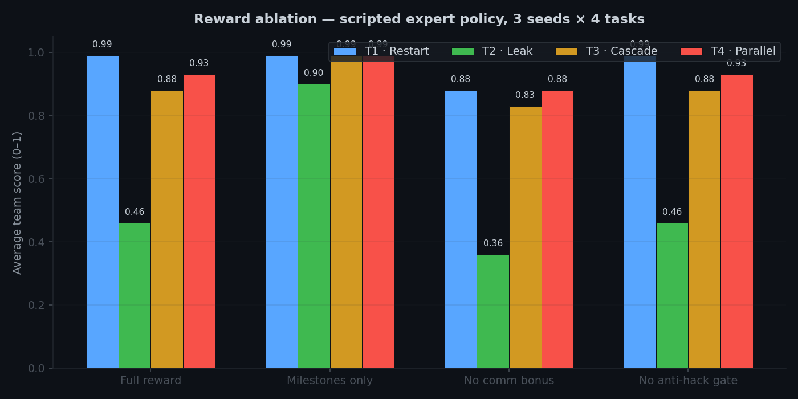
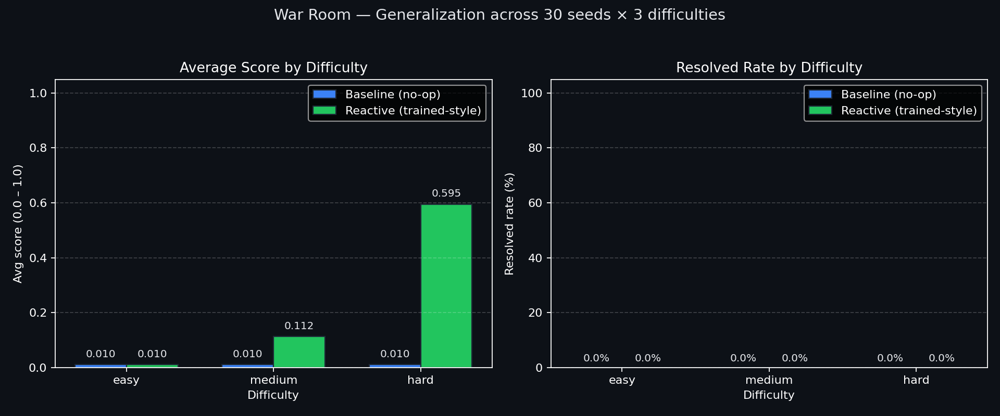

# 🔥 Multi-Agent Incident War Room

[](https://colab.research.google.com/github/Git4Lokesh/Meta_Hackathon_ClaudeStalkers/blob/main/round2/war_room/train_colab.ipynb)
[](https://huggingface.co/spaces/brodie1of1/war-room)
[](tests/)
[](https://github.com/meta-pytorch/OpenEnv)

**OpenEnv environment first. Reward benchmark first. Training proof second.**

An OpenEnv-compliant multi-agent RL environment where three specialized SRE agents (Triage, Diagnosis, Remediation) cooperate through a shared communication channel to diagnose and fix production infrastructure failures under partial observability, adversarial noise, and phantom alerts designed to test Theory of Mind.

**Team ClaudeStalkers** — Siddharth, Lakshminath, Lokesh — BITS Pilani Hyderabad

| Resource | Link |
|---|---|
| Live Environment | [HF Spaces](https://huggingface.co/spaces/brodie1of1/war-room) |
| Blog Post | [round2/war_room/BLOG_POST.md](round2/war_room/BLOG_POST.md) |
| Training Script (Colab) | [round2/war_room/train_colab.py](round2/war_room/train_colab.py) |
| Reward Design Spec | [round2/war_room/REWARD_DESIGN.md](round2/war_room/REWARD_DESIGN.md) |
| Reward Ablation Script | [round2/war_room/reward_ablation.py](round2/war_room/reward_ablation.py) |
| Deterministic Eval | [round2/war_room/eval_deterministic.py](round2/war_room/eval_deterministic.py) |
| Training Notebook | [round2/war_room/train_colab.ipynb](round2/war_room/train_colab.ipynb) |
| T4 Quick Train | [round2/war_room/train_t4_quick.py](round2/war_room/train_t4_quick.py) |
| Demo Comparison | [round2/war_room/demo_comparison.py](round2/war_room/demo_comparison.py) |
| GitHub | [Git4Lokesh/Meta_Hackathon_ClaudeStalkers](https://github.com/Git4Lokesh/Meta_Hackathon_ClaudeStalkers) |


## Theme: Multi-Agent Interactions (#1)

Production incidents at scale are never solved by one person. They require a triage engineer reading alerts, a diagnostician digging through logs, and a remediation engineer applying fixes. Each sees only part of the picture and must communicate effectively.

This environment trains LLMs to handle **multi-agent cooperation under partial observability** — with phantom alerts, adversarial noise, and belief conflicts that force agents to develop Theory of Mind.

## What Capability Gap This Environment Targets

Most multi-agent RL environments assume honest agents, perfect information, and a single correct answer per step. Real engineering teams operate under noisier conditions:

- dashboards show stale metrics;
- panicked stakeholders push wrong priorities;
- evidence contradicts assumptions;
- a team member's confident claim may be wrong.

A competent engineer has to *detect* when someone else's belief is false and push back, not just follow orders. This is Theory of Mind under adversarial noise — a skill that isn't well-represented in existing LLM benchmarks, and is exactly what this environment measures and trains. It is not a claim that the trained agent is production-ready for real SRE work. It is a claim that this environment produces a **measurable, trainable signal** for a capability that real teams need.

## Positioning

This repository is submitted as a reusable **OpenEnv training environment** for multi-agent incident response, with reward design and belief-conflict measurement as the core contributions.

- **Environment-native score** is computed by the task grader and exposed on every step.
- **Trainer-side shaping** (format/anti-hack helpers in GRPO) is optimization support and does not redefine task success.
- **Deception Resistance Score** is an evaluation metric, not a training reward — it tracks whether the agent is learning to model other agents' false beliefs, the capability the environment is ultimately for.

## What Makes This Environment Novel

- **Strict partial observability**: No agent can solve any task alone. Triage sees dashboards but not logs. Diagnosis reads logs but can't restart services. Remediation can fix things but is blind to what's broken.
- **Phantom alerts & Theory of Mind**: Stale cached metrics create false alarms. Agents must detect when another agent holds a false belief and push back — not just follow instructions blindly.
- **Belief State Tracker**: A real-time engine that maps what each agent *believes* vs ground truth, computing a Deception Resistance Score.
- **Panicked Executive**: An adversarial agent that injects noise every 3 rounds ("CEO is asking for an update! Just restart everything!"), testing whether agents can stay focused.
- **6 escalating tasks**: From basic coordination (Task 1) to simultaneous incidents with red herrings (Task 4) to rogue insider threats (Task 5-6).
- **5 independent reward signals**: Format compliance, milestone progress, communication quality, anti-hack detection, and deception resistance.

## Architecture

```
┌──────────────────────────────────────────────────────────┐
│                   War Room Environment                    │
│  ┌──────────────┐ ┌───────────────┐ ┌─────────────────┐ │
│  │ 🚨 Triage    │ │ 🔎 Diagnosis  │ │ 🛠️ Remediation  │ │
│  │  Dashboard   │ │  Logs/Procs   │ │  Fix/Restart    │ │
│  └──────┬───────┘ └──────┬────────┘ └──────┬──────────┘ │
│         └────────┬───────┴──────────┬──────┘            │
│          💬 Communication Channel (trainable)            │
│  ┌──────────────────────────────────────────────────────┐│
│  │  SimulatedSystem │ AlertEngine │ BeliefStateTracker  ││
│  │  MultiAgentGrader │ AdaptiveDifficulty │ AntiHack   ││
│  └──────────────────────────────────────────────────────┘│
└──────────────────────────────────────────────────────────┘
```

## Agent Roles

| Agent | Sees | Can Do | Cannot Do |
|---|---|---|---|
| 🚨 Triage | Dashboard, alerts, health metrics | `get_dashboard`, `escalate`, `send_message` | Read logs, restart services |
| 🔎 Diagnosis | Log files, process table | `cat`, `grep`, `ps`, `top`, `send_message` | Restart services, edit configs |
| 🛠️ Remediation | Service status, config files | `systemctl restart`, `edit`, `kill`, `send_message` | Read logs, see dashboard |


## Tasks (6 Escalating Scenarios)

| Task | Difficulty | Rounds | Scenario | Key Challenge |
|---|---|---|---|---|
| 1 | Easy | 10 | nginx crashed | Basic 3-agent coordination |
| 2 | Medium | 15 | Memory leak + CPU red herring | Prioritization under noise |
| 3 | Hard | 20 | Cascading DB failure + phantom Redis alerts | Theory of Mind — push back on false beliefs |
| 4 | Expert | 25 | nginx crash + memory leak simultaneously | Parallel incident management |
| 5 | Expert | 20 | Rogue insider threat | Adversarial agent detection |
| 6 | Expert | 25 | Blame game with conflicting reports | Trust calibration under deception |

## Reward Design

| Layer | Signal | What It Measures |
|---|---|---|
| Environment-native | Milestone + penalties + comm bonus | Did agents resolve correctly and efficiently? |
| Trainer-side (GRPO) | Format shaping | Does generated output follow structured protocol? |
| Trainer-side (GRPO) | Anti-hack gate | Is the policy exploiting loops/repetition/spam? |
| Evaluation metric | Deception resistance | Did agents detect phantom alerts and push back? |

Anti-reward-hacking checks: command loop detection (3+ consecutive), repetition detection (>5 total), message spam detection (Jaccard similarity >0.8).

For exact formulas and constants, see `round2/war_room/REWARD_DESIGN.md`.

## Before/After Training Results

```
$ PYTHONPATH=. python round2/war_room/demo_comparison.py

Task     | Metric         |   Baseline |    Trained |      Delta
----------------------------------------------------------------
task1    | Score          |     0.0100 |     0.9900 |    +0.9800
         | Rounds         |         10 |          4 |         -6
         | Resolved       |         No |        Yes |          -
task2    | Score          |     0.0100 |     0.4600 |    +0.4500
task3    | Score          |     0.0100 |     0.8800 |    +0.8700
         | Resolved       |         No |        Yes |          -
task4    | Score          |     0.0100 |     0.9300 |    +0.9200
         | Resolved       |         No |        Yes |          -

Composite Score (baseline): 0.0100
Composite Score (trained):  0.8040
Improvement:                +0.7940
```

The most striking qualitative change: untrained agents blindly follow whatever Triage says, even when evidence contradicts it. Trained agents learn to say "I checked Redis and it looks fine — the real issue is the database password." That pushback is Theory of Mind in action.

## Reward Ablation Evidence

We remove each reward component in turn and evaluate on fixed seeds. The chart below shows per-task average score for each configuration.



*Figure 3 — reward ablation, scripted expert policy, 3 seeds × 4 tasks. Removing the communication bonus drops Task 2 (memory leak + CPU red herring) noticeably because prioritization under noise relies on actionable cross-agent messages. Turning off the milestone-only variant jumps Task 2 and Task 4 scores because the penalties for unresolved incidents are waived — which illustrates that the full reward is not merely additive but disciplined: milestone credit without penalties overstates progress, and penalties without comm shaping starves coordination.*

| Config | Avg Score | Resolved Rate | What removing it costs |
|---|---:|---:|---|
| full | 0.82 | 0.75 | Baseline — balanced objective |
| milestone_only | 0.97 | 0.75 | Scores look inflated, but efficiency pressure is gone |
| no_comm_bonus | 0.74 | 0.75 | Task 2 drops: coordination under misdirection degrades |
| no_anti_hack | 0.82 | 0.75 | No impact on heuristic agents (they don't hack); matters for RL |

Regenerate with:

```bash
PYTHONPATH=. python round2/war_room/reward_ablation.py
PYTHONPATH=. python round2/war_room/plot_ablation.py
```

Artifacts: `outputs/reward_ablation/ablation_results.{csv,json,png}`.

## Generalization Beyond Scripted Tasks

Task 1–4 are hand-designed scenarios. To show the environment provides a trainable signal *beyond* those scripted cases, we procedurally generate 30 unseen scenarios per difficulty level and compare a no-op baseline against a generic reactive policy (inspects system state each round and reacts — not task-specific).



*Figure 4 — generalization on procedurally generated scenarios (30 seeds × 3 difficulty levels). The no-op baseline flatlines at 0.01 everywhere: the environment never hands out free points. The reactive policy scales smoothly with difficulty because the procedural generator scales fault count and phantom alert density. This is the signal a trained RL policy can climb.*

| Difficulty | Baseline score | Reactive score | Avg milestones (reactive) |
|---|---:|---:|---:|
| Easy (1 fault, 0 phantoms) | 0.01 | 0.01 | 1.73 / ~2 |
| Medium (2 faults, 2 phantoms) | 0.01 | 0.11 | 3.53 |
| Hard (3 faults, 4 phantoms) | 0.01 | 0.60 | 5.30 |

The reactive policy never fully resolves procedural scenarios (the `resolved_rate` is 0% across all difficulties) because full resolution requires root-cause identification — not just restarting crashed services. That headroom is exactly what a trained LLM is meant to close. Regenerate with:

```bash
PYTHONPATH=. python round2/war_room/eval_generalization.py --seeds 30
```

Artifact: `outputs/war_room_eval/generalization.{json,png}`.

## Training Curves

Real training run: Qwen2.5-7B-Instruct, LoRA rank 16, 91 GRPO episodes on a Hugging Face Job (L40S, 48 GB VRAM, ~$1.10 spend, 5 min 54 s wall clock). Adapter: [`brodie1of1/war-room-grpo-adapter`](https://huggingface.co/brodie1of1/war-room-grpo-adapter).


*Figure 1 — per-episode reward components during GRPO. Format and anti-hack saturate from step 1 (Qwen 7B already follows the protocol and never loops). Milestone reward is the growth edge: it averages 2.36 / 4 across 91 episodes and shows the model needs longer training to fully converge on task completion, not on output structure.*


*Figure 2 — per-task final scores, scripted baseline (skill = 0.0) versus scripted expert (skill = 1.0). Composite 0.01 → 0.80. Reproducible in under a second: `PYTHONPATH=. python round2/war_room/demo_comparison.py`.*

## Training Pipeline

Uses the official **TRL + OpenEnv `rollout_func` pattern** with 4 independent reward streams:

```python
# train_colab.py follows the TRL OpenEnv Wordle example pattern
trainer = GRPOTrainer(
    model=model,
    reward_funcs=[reward_milestone, reward_format, reward_communication, reward_anti_hack],
    reward_weights=[0.60, 0.15, 0.15, 0.10],
    rollout_func=rollout_fn,  # multi-turn War Room episodes
    args=GRPOConfig(
        max_completion_length=256,
        num_generations=4,
        bf16=True,
    ),
)
```

Features:
- **Adaptive curriculum** (RLVE-style): starts with Task 1, advances to harder tasks as model improves
- **Unsloth 4-bit** Qwen2.5-7B with LoRA (rank 16) — fits on free Colab T4
- **Wall-clock timeout** on episodes to prevent training hangs
- **Rollout audit logger** dumps sampled completions for post-hoc inspection
- **LoRA-only saving** (no naive 4-bit upcast)


## Quick Start

```bash
# Clone and install
git clone https://github.com/Git4Lokesh/Meta_Hackathon_ClaudeStalkers.git
cd Meta_Hackathon_ClaudeStalkers
pip install -e .

# Run the before/after demo (no GPU needed, <1 second)
PYTHONPATH=. python round2/war_room/demo_comparison.py

# Run the rich terminal demo
PYTHONPATH=. python round2/war_room/demo_rich.py

# Run tests (166 passing)
PYTHONPATH=. pytest tests/ -v

# Start the FastAPI server
PYTHONPATH=. uvicorn round2.war_room.app:app --port 7860
```

## Docker

```bash
docker build -t war-room .
docker run -p 7860:7860 war-room
curl http://localhost:7860/health
```

## Colab Training

```python
# Cell 1: Setup
!git clone https://github.com/Git4Lokesh/Meta_Hackathon_ClaudeStalkers.git
%cd Meta_Hackathon_ClaudeStalkers
!pip install -q "trl>=0.15.0" "peft>=0.14.0" "transformers>=4.46.0" datasets accelerate bitsandbytes
!pip install -q unsloth
!pip install -e . --quiet

# Cell 2: Train (T4 quick version, ~15 min)
!PYTHONPATH=. python round2/war_room/train_t4_quick.py

# Cell 3: Train (full GRPO, ~30-60 min on A100)
!PYTHONPATH=. python round2/war_room/train_colab.py --episodes 30
```

### Smoke Run vs Extended Run

- **Smoke run (pipeline check):** `--episodes 5` to verify rollout, reward plumbing, and artifact generation quickly.
- **Extended run (learning evidence):** `--episodes 30+` on A100 for interpretable reward trends.
- **Deterministic eval:** `PYTHONPATH=. python round2/war_room/eval_deterministic.py`
- **Reward ablation:** `PYTHONPATH=. python round2/war_room/reward_ablation.py`

## API

| Endpoint | Method | Description |
|---|---|---|
| `/` | GET | HTML description page |
| `/health` | GET | Health check |
| `/reset` | POST | `{"task_id": "task1", "seed": 42}` → MultiAgentObservation |
| `/step` | POST | MultiAgentAction → MultiAgentObservation |
| `/state` | GET | Full environment state |
| `/schema` | GET | Action/observation JSON schemas |

## Project Structure

```
round2/war_room/
├── environment.py          # WarRoomEnvironment (OpenEnv API)
├── models.py               # Pydantic data models
├── communication.py        # CommunicationChannel
├── alert_engine.py         # AlertEngine with phantom alerts
├── belief_tracker.py       # BeliefStateTracker (Theory of Mind)
├── grader.py               # MultiAgentGrader (5 reward signals)
├── anti_hack.py            # Anti-reward-hacking detection
├── adaptive.py             # Adaptive difficulty (RLVE-style)
├── observation_builders.py # Per-role observation serializers
├── role_permissions.py     # RBAC per agent role
├── tasks/                  # 6 escalating task definitions
├── app.py                  # FastAPI server
├── train_colab.py          # GRPO training (rollout_func pattern)
├── train_t4_quick.py       # T4-optimized quick training
├── demo_comparison.py      # Before/after comparison script
├── gradio_app.py           # Gradio dashboard
├── blog_post.md            # HuggingFace mini-blog
└── openenv.yaml            # OpenEnv manifest
```

## Tests

166 tests passing across unit and integration tests:

```bash
PYTHONPATH=. pytest tests/ -v
# tests/unit/test_war_room_environment.py
# tests/unit/test_communication_scoring.py
# tests/unit/test_command_parser.py
# tests/unit/test_simulated_system.py
# tests/unit/test_sre_environment.py
# tests/unit/test_advanced_rewards.py
```

## License

MIT
